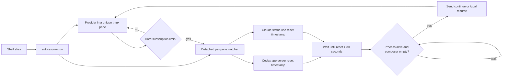

# AutoResume

AutoResume keeps an interactive Codex or Claude Code terminal chat alive through a real subscription usage reset. It supervises the existing provider process in tmux, waits for the provider’s reset timestamp, and types `continue` into the same chat—without bypassing permissions or restarting the session.

[](https://github.com/RussellPetty/AutoResume/actions/workflows/ci.yml)
[](LICENSE)

## Quick start

```bash
curl -fsSL https://raw.githubusercontent.com/RussellPetty/AutoResume/main/install.sh | bash
```

Restart your shell, then use the provider commands normally:

```bash
codex
codex resume
claude
claude --continue
claude --resume
```

Interactive commands are supervised automatically. Version checks, help, Codex subcommands such as `codex exec`, and Claude print mode (`claude -p`) pass straight through. Bypass supervision for one invocation with:

```bash
AUTORESUME_DISABLE=1 codex
AUTORESUME_DISABLE=1 claude
```

## What it does



The watcher polls every two seconds. A timer that becomes overdue while the computer sleeps fires after wake. A reboot, closed tmux pane, or exited provider process cancels the watcher; AutoResume never starts a replacement provider process.

Codex reset data comes from the documented newline-delimited JSON app-server protocol and `account/rateLimits/read`. If that interface is unavailable, AutoResume conservatively parses the local reset time displayed by Codex. The wrapper is intentional: lifecycle hooks may not run when a rate limit terminates a turn ([open Codex issue #21160](https://github.com/openai/codex/issues/21160)). See the [Codex app-server protocol](https://github.com/openai/codex/blob/main/codex-rs/app-server/README.md).

Claude Code supplies `session_id`, `transcript_path`, usage percentages, and exact five-hour/seven-day `resets_at` values to a [status-line command](https://code.claude.com/docs/en/statusline). AutoResume chains any command that was already configured and uses an inherited instance ID to correlate concurrent sessions. Claude’s [local session persistence](https://code.claude.com/docs/en/sessions) remains unchanged.

## Concurrent sessions

Each session has an independent pane, watcher, and reset timer. There is no global queue or throttle:

```bash
# Terminal 1
codex resume

# Terminal 2
claude --continue

# Terminal 3
codex
```

If all three are eligible at the same moment, all three resume immediately.

## Commands

```text
autoresume status            Show recorded supervised sessions and timers
autoresume logs [instance]   Show one watcher log (latest when omitted)
autoresume doctor            Check Python, tmux, providers, and adapters
autoresume enable            Enable supervision
autoresume disable           Disable supervision without uninstalling
autoresume update            Install the newest version from main
autoresume uninstall         Restore integrations and remove AutoResume
```

Configuration lives in `~/.config/autoresume/config.json`:

```json
{
  "schema_version": 1,
  "enabled": true,
  "poll_seconds": 2,
  "grace_seconds": 30,
  "continuation_prompt": "continue"
}
```

Runtime state and logs live in `~/.local/state/autoresume/`. Both paths respect `XDG_CONFIG_HOME` and `XDG_STATE_HOME`.

## Supported versions

| Component | Support | Verification |
|---|---|---|
| macOS | Current releases with Python 3.9+ and tmux | CI plus local macOS smoke tests |
| Linux | Current distributions with Python 3.9+ and tmux | Ubuntu CI |
| Codex CLI | Interactive CLI with `app-server`; terminal-time fallback for interface changes | Tested with 0.145.0 |
| Claude Code | Interactive CLI with status-line JSON | Tested with 2.1.191 |
| Windows | Not supported in v0.1 | Use WSL only as an unverified Linux environment |

AutoResume does not supervise IDE chats, desktop applications, cloud-only sessions, `codex exec`, or `claude -p`.

## Installation options

```bash
# Non-interactive dependency install
curl -fsSL https://raw.githubusercontent.com/RussellPetty/AutoResume/main/install.sh | bash -s -- --yes

# Do not edit shell startup files
./install.sh --no-aliases

# Install under another prefix
./install.sh --prefix "$HOME/.local"

# Remove it
./install.sh --uninstall --yes
```

The idempotent installer supports Bash and Zsh. It installs versioned files under `~/.local/share/autoresume`, links `~/.local/bin/autoresume`, and marks its shell block clearly. It detects tmux and can install it through Homebrew, apt, dnf, or pacman. Before changing `~/.claude/settings.json`, it writes a timestamped backup. Repeated installs preserve the original status-line chain; uninstall restores it if it has not since been replaced manually.

## Security model

AutoResume has a deliberately narrow authority boundary:

- It reads only terminal pane output, its own configuration/state, Claude’s documented status-line payload, and the correlated Claude transcript.
- It never reads provider authentication files, tokens, keychains, or account secrets.
- It never approves tools, changes permission modes, bypasses permissions, or answers approval prompts.
- It only recognizes hard subscription usage-limit messages. Workspace spend caps, depleted credits, authentication failures, context limits, and ordinary 429/529 errors are not retried.
- Before typing, it rechecks that the provider process exists and requires a verifiably empty composer. A draft delays injection indefinitely.
- All eligible panes resume independently. There is no remote service, telemetry, or network call except Codex/Claude themselves and an explicit `autoresume update`.

The Codex adapter starts a short-lived local `codex app-server` process, performs the documented initialization handshake, reads rate-limit metadata, then terminates it. It does not consume reset credits.

See [SECURITY.md](SECURITY.md) for vulnerability reporting.

## Troubleshooting

Run:

```bash
autoresume doctor
autoresume status
autoresume logs
```

Common cases:

- `autoresume: tmux is required`: install tmux or rerun the installer with `--yes`.
- Commands are not supervised: restart the shell, confirm `~/.local/bin` is on `PATH`, and check `alias codex` / `alias claude`.
- Status says `draft-blocked`: clear the provider composer. AutoResume will retry its safety check without erasing the draft.
- Status says `limit-detected-no-reset`: the provider reported a limit but no trustworthy future reset was available. Update the provider CLI and run `autoresume doctor`.
- Claude has no rate-limit record: the documented `rate_limits` field appears only for Claude.ai subscribers after the first API response. Check that the installed status-line shim is configured.
- A laptop rebooted: restart or resume the provider yourself. Timers intentionally do not survive provider-process exit or reboot.

## Development

The runtime uses only Python’s standard library and tmux.

```bash
python3 -m py_compile src/autoresume.py src/statusline.py
python3 -m unittest discover -s tests -v
bash -n install.sh
```

The integration suite launches fake interactive provider CLIs inside real tmux panes; it does not consume provider usage. See [CONTRIBUTING.md](CONTRIBUTING.md).

## Limitations

- Provider terminal wording and TUI layout can change. Recognition is intentionally conservative, so an unknown message or composer layout fails closed.
- Codex’s displayed-time parser is only a fallback; app-server timestamps are preferred.
- Claude rate-limit metadata is unavailable for API-key billing and may be absent before the first response.
- The original process and tmux server must stay alive. AutoResume does not provide reboot persistence.
- Existing provider permissions still apply after continuation and may require the user.

## License

MIT © Russell Petty. See [LICENSE](LICENSE).
